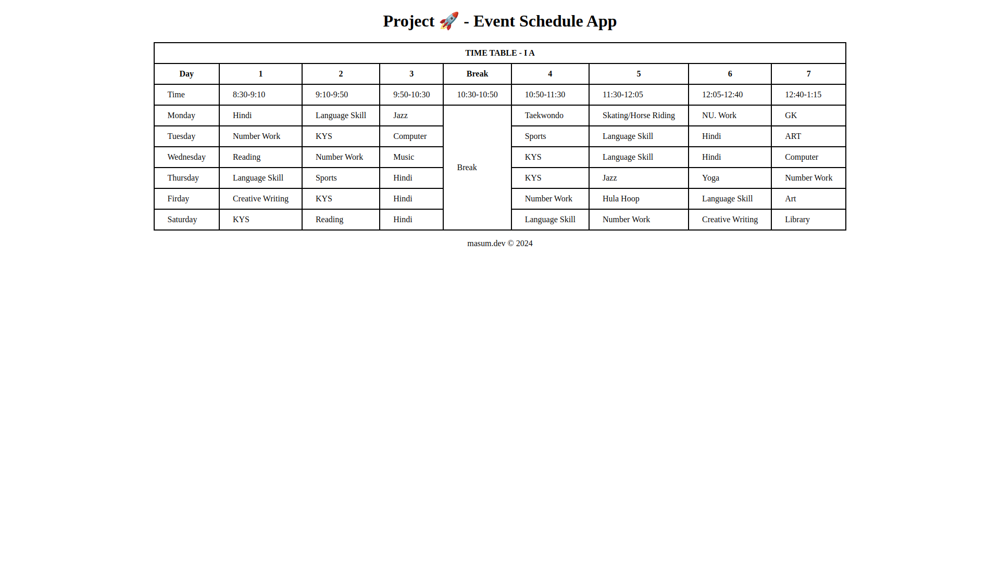

# Project 🚀 - Event Schedule App

This HTML page demonstrates a simple class schedule using a table for clear organization. It's a good example of how the HTML table tag can be used to structure event data.

## Live Preview

[Project 🚀 - Event Schedule App](https://masum-dev-event-schedule-app.netlify.app)

## Screenshot

## Technology Used

* HTML
* CSS