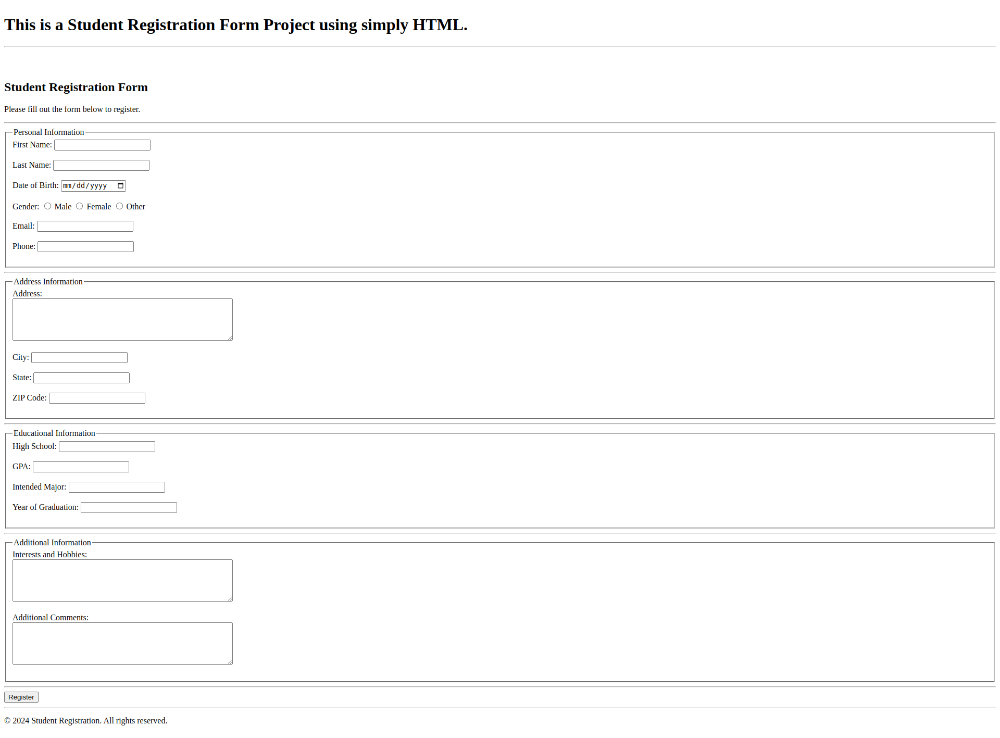

# Project 🚀 - Student Registration Form using HTML

This HTML page demonstrates a simple Student Registration Form. It's a good example of how the HTML form and input tag can be used to make forms.

## Live Preview

[Project 🚀 - Student Registration Form using HTML](https://masum-dev-student-registration-form.netlify.app)

## Screenshot

## Technology Used

* HTML